## **💰 moaga: 가족 지출 공유 분석 프로젝트**

마이데이터 서비스를 가족 단위로 확장해, 
구성원이 함께 지출을 공유하고 분석하며,
공동의 목표를 관리할 수 있는 서비스 모아가입니다.
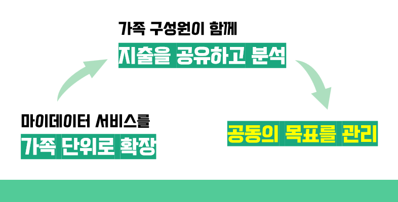

## ✨ 주요 기능
- **회원가입/로그인**: 가족, 룸메이트, 친구들과 함께 계좌와 카드를 연결하여 공동 지출을 실시간으로 추적하고 관리할 수 있습니다.

<table>
  <tr>
    <td>
      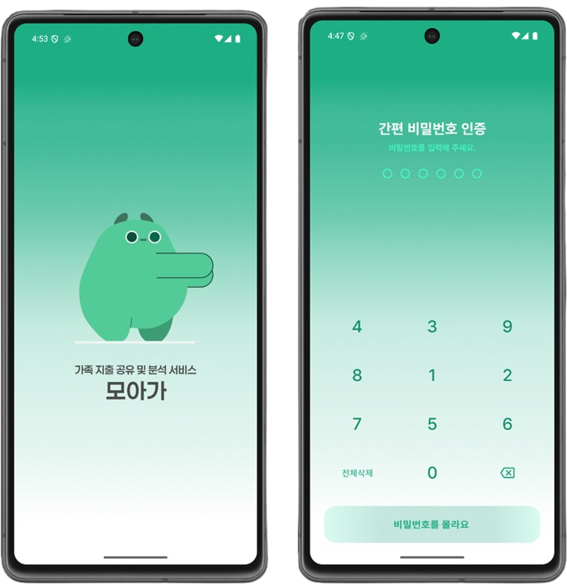
    </td>
  </tr>
  <tr>
    <td>
      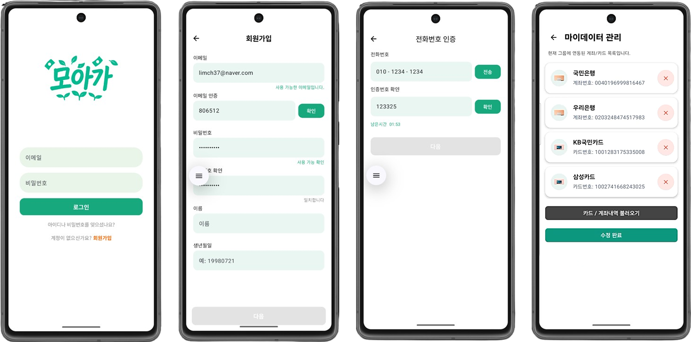
    </td>
  </tr>
</table>
<br>

- **금융 계좌 연동**: SSAFY 금융 API와 연동하여 실제 은행 계좌와 신용카드를 안전하게 연결하고 관리할 수 있습니다.
<table>
  <tr>
    <td>
      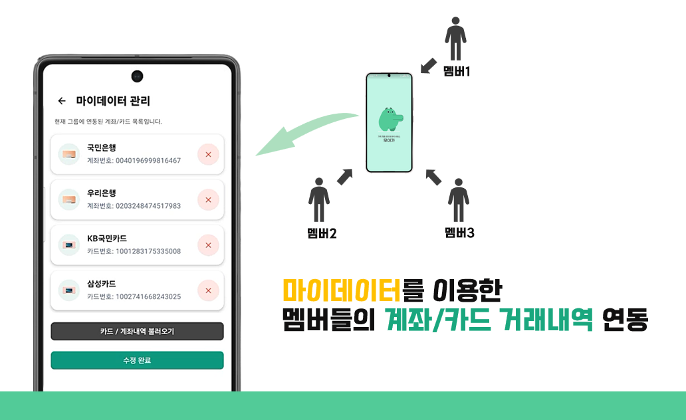
    </td>
  </tr>
</table>
<br>

- **가족 일별 지출 내역 확인**: 개인 및 그룹의 지출 내역을 카테고리별로 분석하고, 월별 비교 및 트렌드를 시각화하여 제공합니다.
<table>
  <tr>
    <td>
      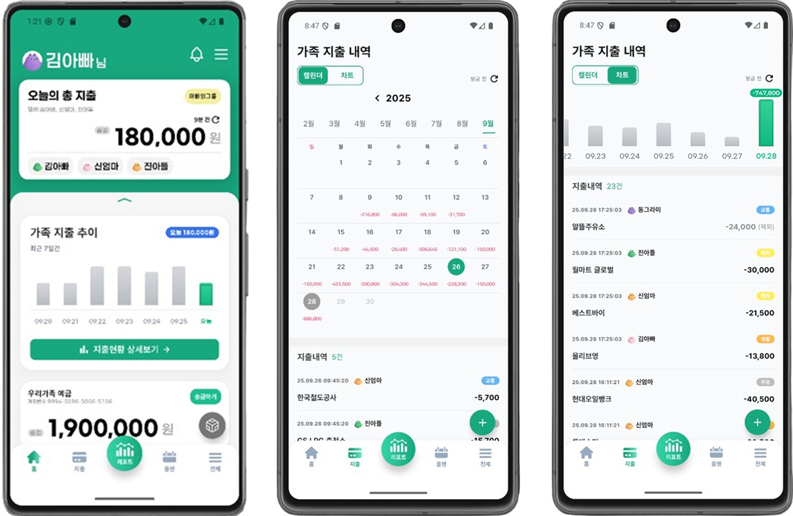
    </td>
  </tr>
</table>
<br>

- **상세 지출 내역 확인**: 개인 및 그룹의 지출 내역을 카테고리별로 분석하고, 월별 비교 및 트렌드를 시각화하여 제공합니다.
<table>
  <tr>
    <td>
      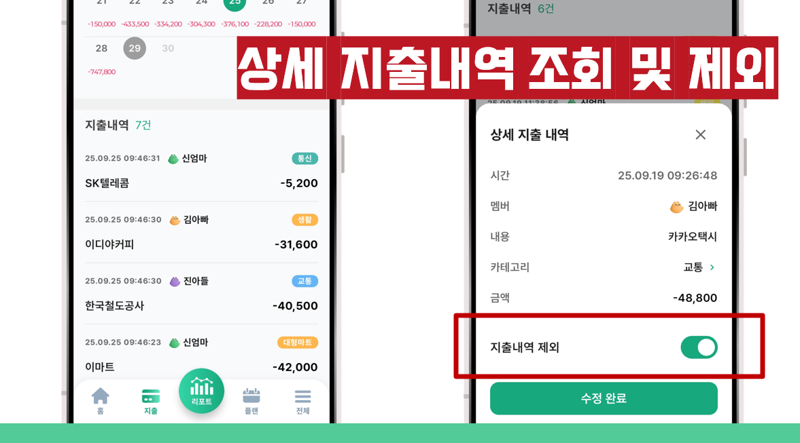
    </td>
  </tr>
</table>
<br>


- **가족 지출 분석 리포트**: 매일 자정 자동으로 연결된 모든 계좌와 카드의 거래 내역을 동기화하여 최신 정보를 유지합니다.
<table>
  <tr>
    <td>
      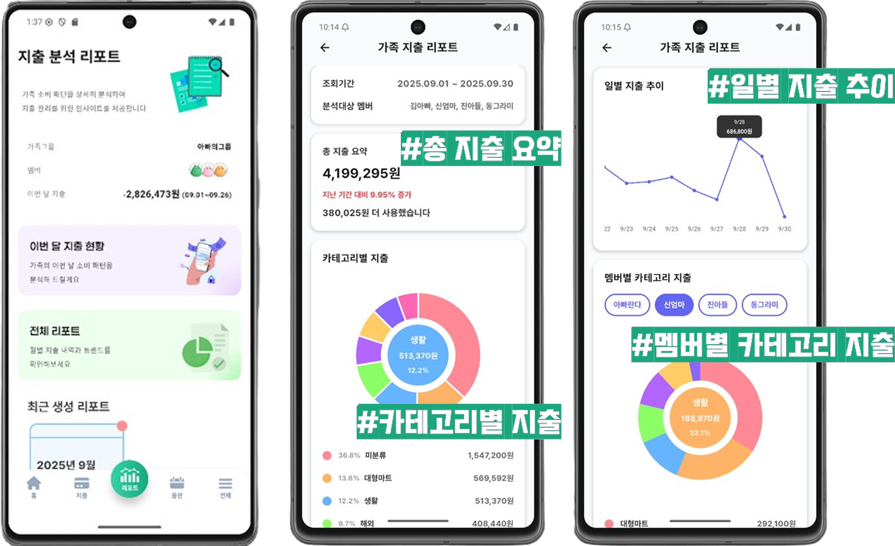
    </td>
  </tr>
</table>
<br>


- **AI 월간 리포트**: GPT-4를 활용하여 매월 1일 자동으로 그룹의 지출 패턴을 분석하고 맞춤형 재무 인사이트를 제공합니다.
<table>
  <tr>
    <td>
      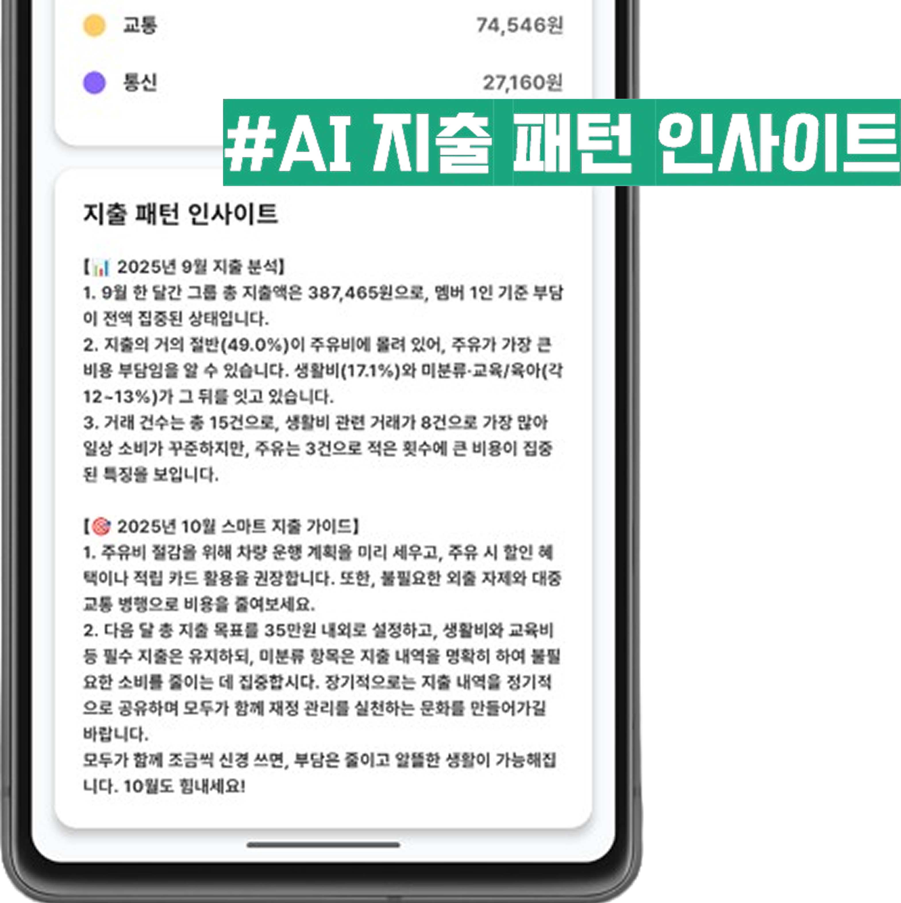
    </td>
  </tr>
</table>
<br>

- **그룹 저축 플래너**: 목표 금액과 기간을 설정하여 그룹원들과 함께 자동 적금을 운영하고, 저축 목표 달성을 추적할 수 있습니다.
<table>
  <tr>
    <td>
      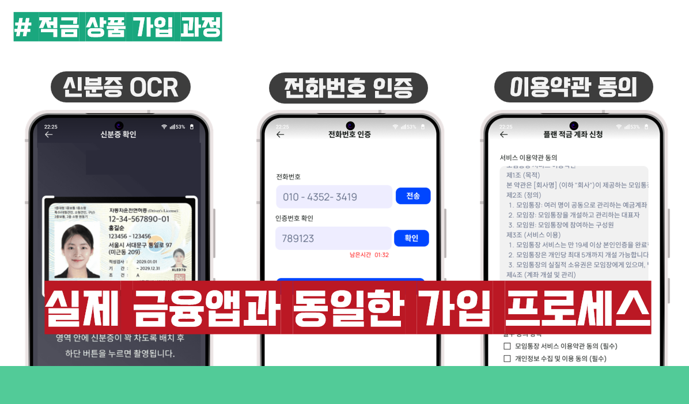
    </td>
  </tr>
  <tr>
    <td>
      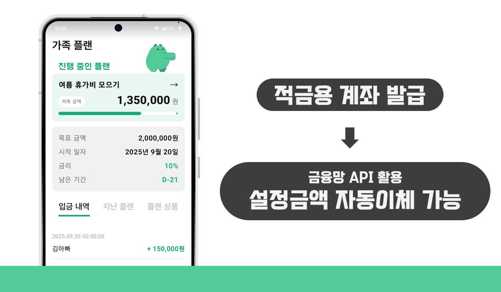
    </td>
  </tr>
</table>
<br>


- **스마트 알림**: 저축 플래너 생성, 월간 리포트 생성, 거래 내역 업데이트 등 중요한 이벤트에 대한 푸시 알림을 제공합니다.
<table>
  <tr>
    <td>
      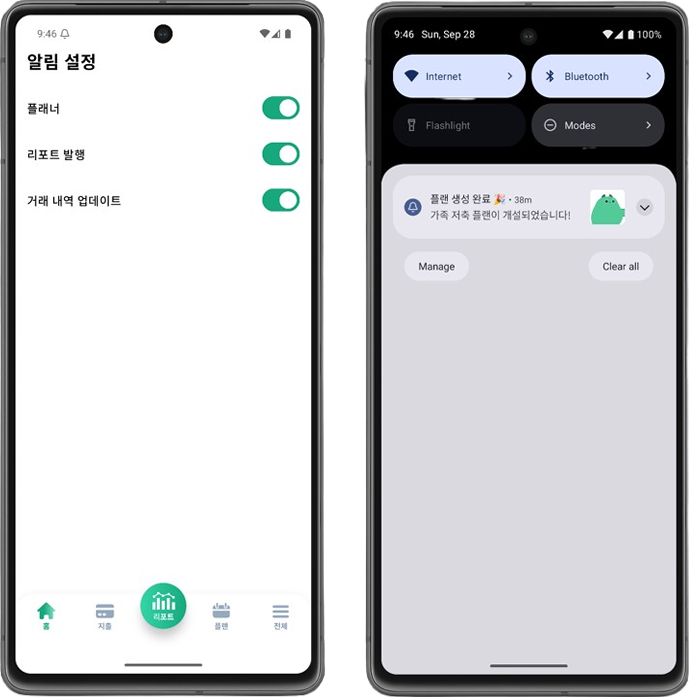
    </td>
  </tr>
</table>
<br>

## 🛠️ 기술 스택

| 구분 | 기술 |
| --- | --- |
| **Backend** | Java, Spring Boot, Spring Data JPA, PostgreSQL, Redis |
| **Mobile** | Kotlin, Jetpack compose |
| **External APIs** | SSAFY Financial API, OpenAI GPT-4, Firebase FCM, CoolSMS |
| **Infra** | Docker, Docker Compose, Jenkins, Nginx, Grafana, Loki, Promtail |


## 🎨 와이어프레임


## 🚀 시작하기
- 자세한 사항은 `exec/포팅 매뉴얼.pdf` 참고

### 설치 및 실행

1.  **저장소 복제**
    ```bash
    git clone https://lab.ssafy.com/s13-fintech-finance-sub2/S13P21D105.git
    cd S13P21D105
    ```

2.  **환경 변수 설정**
    -   프로젝트 루트 디렉토리에 `.env` 파일을 생성하고 필요한 환경 변수를 설정합니다.
    -   `backend/d105/src/main/resources/application.yml`에서 데이터베이스 연결 정보를 설정합니다.

3.  **데이터베이스**
    -   PostgreSQL 서버에 `d105_db` 데이터베이스를 생성하고 덤프 데이터를 입력합니다.
    -   `exec/d105_schemas_final.sql` 파일을 pgAdmin에서 열고 스크립트를 실행행합니다.

4.  **Docker Compose를 이용한 전체 서비스 실행**
    ```bash
    docker-compose up --build -d
    ```

5.  **서비스 접속**
    -   **Frontend**: `http://localhost:5173`
    -   **Backend API**: `http://localhost:8080/swagger-ui/index.html`
    -   **Grafana**: `http://localhost:3000`
